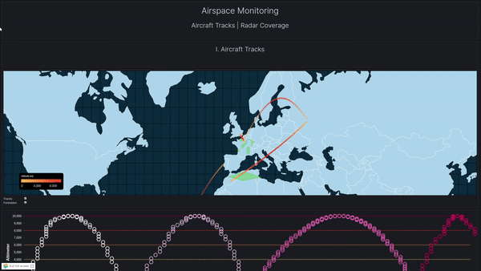
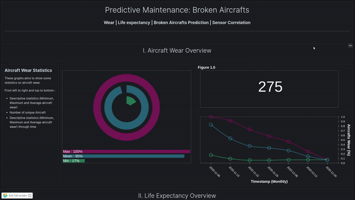

# Punch Demos

> This repo embeds all the ressources to execute some uses cases from end to end.

## Uses cases:
> The following list describes the final uses cases provided by this repo.

1) Airspace Monitoring : Airspace
2) Application Usage Monitoring : Usage

**IN PROGRESS**

3) Aircraft Predictive Maintenance : Aircraft


### 1) Airspace Monitoring

### 2) Application Usage Monitoring

**IN PROGRESS**

### 3) Aircraft Predictive Maintenance


## Repo Structure :
```sh
├── dashboard
├── forwarding
├── generators
├── README.md
└── resources
```
- dashboard : All Kibana resources (Index-pattern, vizualisation, dashboard)
- pipelines : Data Flow configuration
- generators : Data generators
- resources : Additionnal resources
